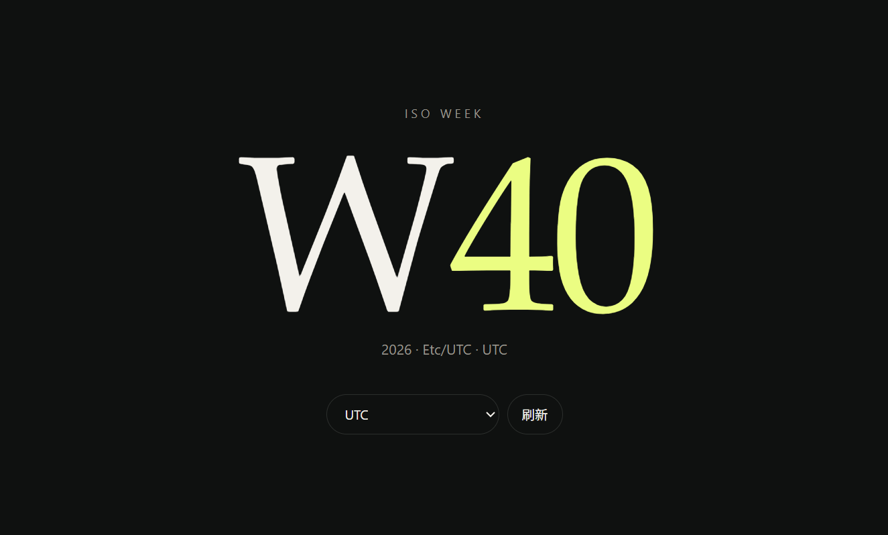

Long time not see!

I’ll be writing weekly updates again, but I’m switching to a weekly blog (just a name).

## Update
### NEW Chat !!!
I’ve deployed a new chat (Fluxer)

https://newchat.pdnode.com

Then Join our guild by using https://newchat.pdnode.com/invite/pdnode

### Zulip
In maintenance mode; rarely used. Please use "New Chat." It will eventually reach its End of Life (EOL).

### Florum
I’ve deployed Flarum, but I don’t know what to use it for.
f.pdnode.com

### Weeks?
I wanted to restart this blog but didn't want to write out the weekly dates like I did last time, so I simply created a website to track which week of the year it is.

:::tip
This website use AI
:::
https://weeks.pdnode.com/

### More?
I really don't know what to write; I hope some people can give me some suggestions.
